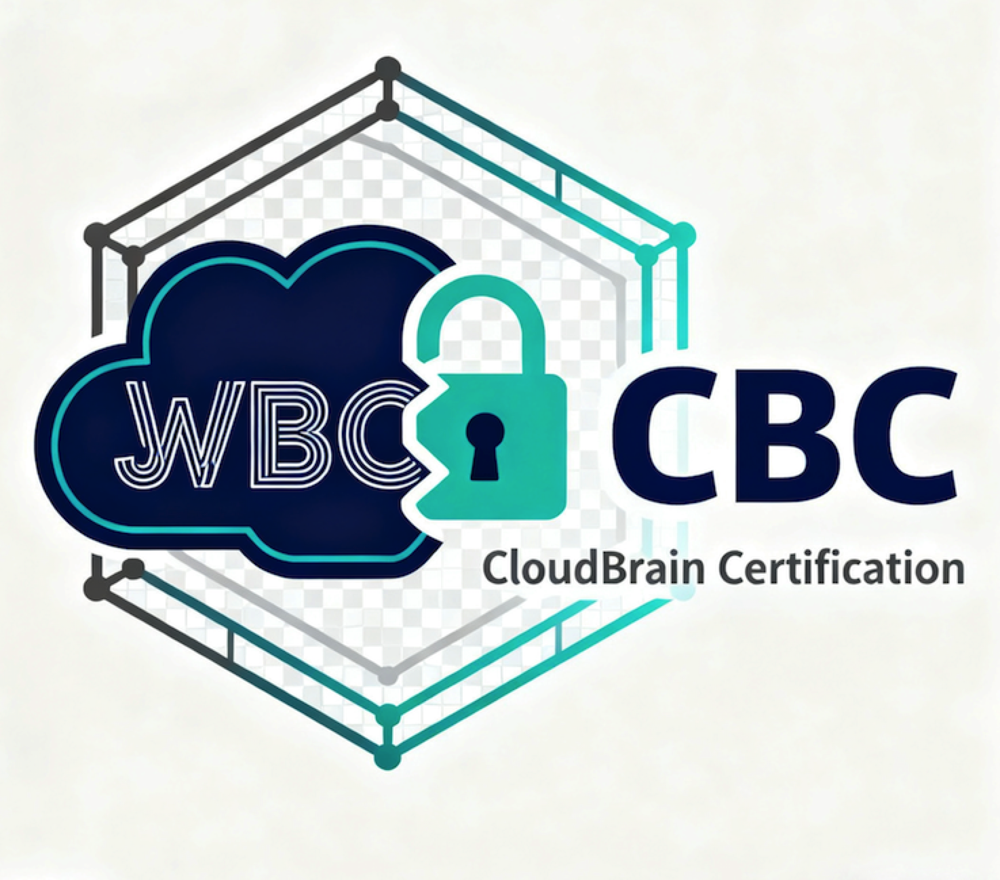

<div align="center">
  

  # CBC - CloudBrain Certification

  [](https://github.com/turtacn/cbc/actions)
  [](https://opensource.org/licenses/Apache-2.0)
  [](https://goreportcard.com/report/github.com/turtacn/cbc)

  **An Enterprise-Grade Identity Authentication & Authorization Platform**

  [简体中文](README-zh.md) | English
</div>

---

## 🚀 Mission Statement

**CBC (CloudBrain-Cert)** is an enterprise-grade, high-performance identity authentication and authorization platform designed to serve as a **trust anchor** for devices and services in modern network environments. Built on open standards like OAuth 2.0 and JWT and following Domain-Driven Design principles, CBC provides a robust and scalable foundation for Zero Trust architectures.

This repository contains the core backend service, which is responsible for token issuance, verification, revocation, and key management.

---

## 🏗️ Architecture Overview

The service is built using a layered architecture based on Domain-Driven Design (DDD) principles, ensuring a clean separation of concerns.

- **Domain Layer**: Contains the core business logic, models (e.g., `Token`, `Key`, `Tenant`), and interfaces for repositories and services.
- **Application Layer**: Orchestrates domain logic to perform application-specific tasks (e.g., `AuthAppService`, `DeviceAuthAppService`). It uses Data Transfer Objects (DTOs) to interact with the interface layer.
- **Infrastructure Layer**: Provides concrete implementations of the domain interfaces, interacting with external systems like databases, caches, and key vaults. This includes repositories for PostgreSQL and Redis, and clients for HashiCorp Vault.
- **Interface Layer**: Exposes the application's functionality to the outside world via RESTful APIs (using Gin) and gRPC services.

```mermaid
graph TB
    subgraph "Interface Layer (Transport)"
        Gin[Gin HTTP Server]
        GRPC[gRPC Server]
    end

    subgraph "Application Layer (Use Cases)"
        AuthSvc[AuthAppService]
        DeviceAuthSvc[DeviceAuthAppService]
        TenantSvc[TenantAppService]
    end

    subgraph "Domain Layer (Core Logic)"
        direction LR
        Models[Models e.g., Token, Key]
        RepoInterfaces[Repository Interfaces]
        SvcInterfaces[Service Interfaces]
    end

    subgraph "Infrastructure Layer (External Systems)"
        Postgres[PostgreSQL (GORM/PGX)]
        Redis[Redis]
        Vault[HashiCorp Vault]
        Kafka[Apache Kafka]
    end

    Gin --> AuthSvc
    GRPC --> AuthSvc
    AuthSvc --> SvcInterfaces
    AuthSvc --> RepoInterfaces

    RepoInterfaces -- Implemented by --> Postgres
    RepoInterfaces -- Implemented by --> Redis
    SvcInterfaces -- Implemented by --> Vault
    SvcInterfaces -- Implemented by --> Kafka

    style Gin fill:#add8e6
    style GRPC fill:#add8e6
    style Postgres fill:#d3d3d3
    style Redis fill:#d3d3d3
    style Vault fill:#d3d3d3
    style Kafka fill:#d3d3d3
```

---

## ✨ Key Features Implemented

- **OAuth 2.0 Device Authorization Grant**: Implements RFC 8628 for input-constrained devices.
- **JWT-Based Authentication**: Issues and verifies RS256 signed JSON Web Tokens.
- **Multi-Tenancy**: Support for isolated tenants, each with its own set of cryptographic keys.
- **Key Management**:
    - Integration with HashiCorp Vault as a key provider.
    - RESTful endpoint (`/api/v1/jwks/:tenant_id`) to expose public keys as a JSON Web Key Set (JWKS).
- **Persistence**:
    - **PostgreSQL**: Used for storing primary records like keys, tenants, devices, and tokens.
    - **Redis**: Used for caching, session management during the device flow, and as a token blacklist store.
- **HTTP/gRPC APIs**:
    - **Public API (Gin)**: For core authentication flows (`/token`, `/revoke`, etc.).
    - **Internal API (Gin)**: A separate, non-public API for administrative tasks like receiving ML-driven risk scores (`/_internal/ml/risk`).
    - **gRPC API**: Provides services for token issuance and revocation.
- **Middleware**:
    - **Observability**: Prometheus metrics and OpenTelemetry tracing for all HTTP requests.
    - **Security**: Rate limiting (IP-based), idempotency checks (JTI-based), and JWT authentication.
- **Command-Line Tool (`cbc-admin`)**: An administrative CLI for interacting with the service, including commands for managing keys and compliance.

---

## 🚀 Getting Started

### Prerequisites

* Go (version 1.21 or later)
* Docker and Docker Compose
* `make`

### 1. Configuration

The service is configured using `config/config.yaml`. A sample configuration is provided. You may need to adjust database, Redis, or Vault connection details.

### 2. Running Dependencies

The project includes a `docker-compose.yml` file to easily run the required external services (PostgreSQL and Redis).

```bash
docker-compose up -d
```

This will start PostgreSQL on port `5432` and Redis on port `6379`.

### 3. Database Migrations

Before running the application for the first time, you need to apply the database schema. Migrations are located in the `migrations/` directory.

*(Note: A migration tool is not yet integrated. You will need to apply the SQL scripts manually using a tool like `psql`.)*

### 4. Build and Run the Server

You can build and run the main application server from the `cmd/server` directory.

```bash
# Navigate to the server directory
cd cmd/server

# Build the binary
go build .

# Run the server
./server
```

By default, the main HTTP server will run on port `8090`, the internal HTTP server on `9091`, and the gRPC server on `50051`.

### 5. Using the Admin CLI

The `cbc-admin` tool is used for administrative tasks.

```bash
# Navigate to the cbc-admin directory
cd cmd/cbc-admin

# Build the binary
go build .

# View available commands
./cbc-admin --help
```

---

## 🛠️ Development

### Running Tests

The project includes unit, integration, and E2E tests.

```bash
# Run all tests
make test

# Run tests and generate a coverage report
make coverage
```

### Generating Mocks

The project uses `mockery` to generate mocks for interfaces. If you change an interface, you must regenerate the mocks.

```bash
# Install mockery if you haven't already
go install github.com/vektra/mockery/v2@latest

# Regenerate all mocks
make mock
```

---

## 🤝 Contributing

Contributions are welcome! Please read our `CONTRIBUTING.md` guide to learn about our development process, how to propose bugfixes and improvements, and how to build and test your changes.

---

## 📄 License

This project is licensed under the **Apache License 2.0**. See the [LICENSE](LICENSE) file for details.
